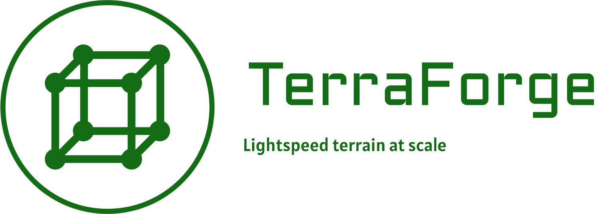

# TerraForge



Welcome to TerraForge, a Rust-based terrain engine designed for high-performance and scalable terrain generation and manipulation. TerraForge leverages advanced algorithms and parallel processing to generate and triangulate vast terrains efficiently.

## Table of Contents!

- [TerraForge](#terraforge)
  - [Table of Contents!](#table-of-contents)
  - [Overview](#overview)
  - [Features](#features)
  - [Installation](#installation)
  - [Usage](#usage)
    - [Triangulation](#triangulation)
    - [Fibonacci Sphere Generation](#fibonacci-sphere-generation)
  - [Contributing](#contributing)
  - [License](#license)

## Overview

TerraForge is built to handle large-scale terrain generation using a Fibonacci sphere algorithm for point distribution and Delaunay triangulation for mesh generation. It is optimized for performance with multi-threaded processing, making it suitable for real-time applications and large datasets.

## Features

- **High Performance**: Utilizes multi-threading and efficient algorithms to ensure quick processing times.
- **Scalable**: Designed to handle large datasets and extensive terrain models.
- **Versatile**: Suitable for various applications, including game development, simulations, and geographic information systems (GIS).

## Installation

To use TerraForge, you need to have [Rust](https://www.rust-lang.org/) installed. You can add TerraForge to your project by including it in your `Cargo.toml` file:

```toml
[dependencies]
spade = "1.9.2" # Add the spade library for Delaunay triangulation
terraforge = { git = "https://github.com/yourusername/terraforge.git" } # Replace with your repo URL
```

## Usage

### Triangulation

TerraForge provides a function to perform Delaunay triangulation on a set of 3D points. The triangulation function projects the points onto a 2D plane for processing.

```rust
use terraforge::perform_triangulation;

fn main() {
    let points = vec![
        (0.0, 0.0, 0.0),
        (1.0, 0.0, 0.0),
        (0.0, 1.0, 0.0),
        (1.0, 1.0, 0.0),
    ];
    
    match perform_triangulation(points) {
        Ok(triangulation) => println!("Triangulation successful!"),
        Err(e) => println!("Error during triangulation: {:?}", e),
    }
}
```

### Fibonacci Sphere Generation

TerraForge includes a function to generate points on a sphere using the Fibonacci lattice method. This is useful for creating evenly distributed points over a spherical surface, ideal for terrain generation on planetary scales.

```rust
use terraforge::generate_fibonacci_sphere;

fn main() {
    let num_samples = 1000;
    let min_latitude = -90.0;
    let max_latitude = 90.0;
    let min_longitude = -180.0;
    let max_longitude = 180.0;
    let seed = 0.5;
    
    match generate_fibonacci_sphere(num_samples, min_latitude, max_latitude, min_longitude, max_longitude, seed) {
        Ok(points) => {
            println!("Generated points:");
            for point in points {
                println!("{:?}", point);
            }
        },
        Err(e) => println!("Error generating points: {:?}", e),
    }
}
```

## Contributing

We welcome contributions to TerraForge! Whether it's reporting bugs, improving documentation, or contributing code, your help is appreciated.

1. Fork the repository.
2. Create a new branch for your feature or bugfix.
3. Commit your changes.
4. Push to your branch.
5. Create a pull request.

Please ensure your code adheres to the existing style and passes all tests.

## License

TerraForge is licensed under the MIT License. See the [LICENSE](LICENSE) file for more details.

---

Thank you for using TerraForge! If you have any questions or feedback, feel free to open an issue on our GitHub repository.
